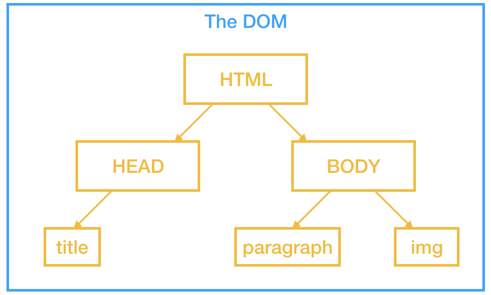

# Website Building

> Monday 23rd September 2019
>
> Week 4

A markup langueage is a structured language which presents infromation in a specific way. Makes use of tags - the fundamental unit in a markup language. Elements will have opening and closing tags:

```html
<p>Grumpy cat</p>
```

This defines a paragraph element, marked by the `p` tags. "Grumpy cat" is the content of the element. Tags can be nested. Don't forget to close your tags!

HTML doesn't care about indentation, but you as a human should! Helps understand document structure/heirarchy.

```html
<root>
  <parent>
    <child>
    	Opportunity fish
    </child>
  </parent>
</root>
```

Is much easier to understnd the structure of, rather than

```html
<root><parent><child>Oppotunity fish</child></parent></root>
```

## HyperText Markup Language (HTML)

Language used to tell browsers how to display a web page.

Code pen - a developemnt environment where you can play/test HTML,CSS,JS.

https://codepen.io/dvejmz/pen/dybwqXR?&editable=true

```html
<!doctype html>
<html>
  <head>
    <title>Hello world</title>
  </head>
  <body>
    <p>Hello world!</p>
  </body>
</html>
```

`<title>` sets the title of the page (i.e. the name which will appear in the tab/window header)

### DOM Document Object Model 

The HTML tree which defines a page.



The line `<!doctype html>` states that this is a HTML document

Head contains metadata for the page. Nothing in here will actually appear on the page usually.

Body contains the content and layout for the page.

### Useful tags


```html
<html>
  <head>
    <title>This is the page title</title>
  </head>
  <body>
    <h1>This is a big heading</h1>
    <h2>This heading is not quite as big</h2>
    <h3>This heading is even smaller</h3>
    <p>This is some paragrph text</p>
    <br> This is a new line
    <strong>This is bold</strong>
    <em>This is italic</em>
  </body>
</html>
```

#### Empty Elements

Empty tags are tags without end tags. These are elements which cannot contain any other tags (nested). e.g.

- `<hr>` makes a horizontal rule
- `<br>` inserts a line break
- `` inserts an image

#### HTML Attributes

specify additional properties of an HTML element.

ptional for many elements, required for a few.

Example: the anchor `<a>` element points to a URL, which must be supplied as an attribute in the opening tag.

e.g.

```html
<a href="www.google.com">Click this test</a>
```

We can also link documents within a dirrectory using a relative path. Once you have navigated to a domain, anything after that first '/' is a relative path (usually), e.g. root/services could take us to a file called `services.html` in the web directory root_url using 

```html
<a href="./services">Go to the sevices page</a>
```

Same with images:

```html


```

#### Nested HTML Elements

`<ol>` an ordered list

`<ul>` unordered list

`<li>` list item

```html
<ol>
  <li>This is list item number one</li>
  <li>This is list item number two</li>
</ol>
```

#### Tables


```html
<table>
  <thead>
    <tr>
      <th>Person</th>
      <th>Drink</th>
    </tr>
  </thead>
  <tbody>
    <tr>
      <td>Scooby doo</td>
      <td>Tea</td>
    </tr>
    <tr>
      <td>Shaggy</td>
      <td>Coffee</td>
    </tr>
  </tbody>
```

