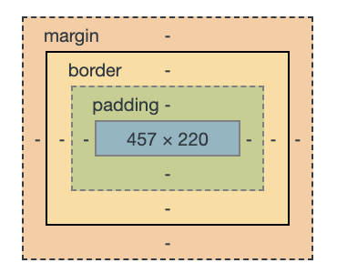

# Website Building

> Monday 23rd September 2019
>
> Week 4

A webpage is made up of three parts:

- Style - CSS
- Layout - HTML
- Content - JS

A markup langueage is a structured language which presents infromation in a specific way. Makes use of tags - the fundamental unit in a markup language. Elements will have opening and closing tags:

```html
<p>Grumpy cat</p>
```

This defines a paragraph element, marked by the `p` tags. "Grumpy cat" is the content of the element. Tags can be nested. Don't forget to close your tags!

HTML doesn't care about indentation, but you as a human should! Helps understand document structure/heirarchy.

```html
<root>
  <parent>
    <child>
    	Opportunity fish
    </child>
  </parent>
</root>
```

Is much easier to understnd the structure of, rather than

```html
<root><parent><child>Oppotunity fish</child></parent></root>
```

## HyperText Markup Language (HTML)

Language used to tell browsers how to display a web page.

Code pen - a developemnt environment where you can play/test HTML,CSS,JS.

https://codepen.io/dvejmz/pen/dybwqXR?&editable=true

```html
<!doctype html>
<html>
  <head>
    <title>Hello world</title>
  </head>
  <body>
    <p>Hello world!</p>
  </body>
</html>
```

`<title>` sets the title of the page (i.e. the name which will appear in the tab/window header)

### DOM Document Object Model 

The HTML tree which defines a page.


The line `<!doctype html>` states that this is a HTML document

Head contains metadata for the page. Nothing in here will actually appear on the page usually.

Body contains the content and layout for the page.

### Useful tags


```html
<html>
  <head>
    <title>This is the page title</title>
  </head>
  <body>
    <h1>This is a big heading</h1>
    <h2>This heading is not quite as big</h2>
    <h3>This heading is even smaller</h3>
    <p>This is some paragrph text</p>
    <br> This is a new line
    <strong>This is bold</strong>
    <em>This is italic</em>
  </body>
</html>
```

#### Empty Elements

Empty tags are tags without end tags. These are elements which cannot contain any other tags (nested). e.g.

- `<hr>` makes a horizontal rule
- `<br>` inserts a line break
- `` inserts an image

#### HTML Attributes

specify additional properties of an HTML element.

ptional for many elements, required for a few.

Example: the anchor `<a>` element points to a URL, which must be supplied as an attribute in the opening tag.

e.g.

```html
<a href="www.google.com">Click this test</a>
```

We can also link documents within a dirrectory using a relative path. Once you have navigated to a domain, anything after that first '/' is a relative path (usually), e.g. root/services could take us to a file called `services.html` in the web directory root_url using 

```html
<a href="./services">Go to the sevices page</a>
```

Same with images:

```html


```

#### Nested HTML Elements

`<ol>` an ordered list

`<ul>` unordered list

`<li>` list item

```html
<ol>
  <li>This is list item number one</li>
  <li>This is list item number two</li>
</ol>
```

#### Tables


```html
<table>
  <thead>
    <tr>
      <th>Person</th>
      <th>Drink</th>
    </tr>
  </thead>
  <tbody>
    <tr>
      <td>Scooby doo</td>
      <td>Tea</td>
    </tr>
    <tr>
      <td>Shaggy</td>
      <td>Coffee</td>
    </tr>
  </tbody>
```

## The class and ID attributes

`class` and `id` are general attributes that can be attacked to any HTML element. They are global.

Allow labelling of HTML elements so we can reefr to them by their class name or ID rather than their tag. Classes can be assigned to as many elements as you like. Each element can have multiple classes, separated by whitespace. Ids are unique to an element, allowing us to uniqueley refer to things on a page.

```html
<p class="">
  This is a helpful paragraph
</p>
<a id="main-site-link" href="a website">Click here</a>
```

## CSS

Cascading Style Sheets - a language uesd to describe the visuals of a document. Gives us fine-grained control over how everything should look in our page, thus helping us make our pages more appealing.

- Controls the position of elements
- Adjust element size
- Fonts
- Colours
- Animations

Some good references:

- MDN CSS reference (Mozilla)
- W3 schools
- HTML5 doctor

### The structure of a CSS document

- element (selector): select the element to styple up
- rule (property): style property to change
- value: property value

```css
element {
  rule: value;
}
```

#### Example

CSS:

```css
/* main.css */
body {
  background-color: blue;
}

p {
  color: red;
  font-size: large;
}
/* This is a comment in CSS */
```

our HTML:

```html
<html>
  <body>
    <p>
      Hello World
    </p>
  </body>
</html>
```

Makes:


### Linking a stylesheet to a web page

```html
<head>
  <link rel="stylesheet" href="css/main.css">
</head>
```

### CSS Selectors

Allows us to refer to one or more HTML elements in our page so we can apply different styles to them.

```html
<h1 id="main-header">
   Some nice red text
</h1>

<h1 class="blue-text large-text">
  Some nice blue text
</h1>
```

```css
h1 {
  color: red;
}

.blue-text {
  color: blue;
}

.large-text {
  font-size: 100px;
}

#main-header {
  /* more styles*/
}
```


Applying multiple styles to an element brings into question order of evaluation.

> More specific CSS selectors override less specific CSS selectors.

Selectors in order of ascending specificity:

- Tag: select all HTML elements with that tag
- Class: select all HTML elements with the given class
- ID: select **only** the element with the given ID (most specific)

### Make a box

HTML:

```html
<div class="box">
</div>
```

CSS:

```css
.box {
  width: 100px; 
  height: 100px; 
  background-color: red; 
  border: 3px solid yellow; 
  margin: auto;
}
```

Makes:


### Positioning elements

#### Static Positioning

Element is positioned according to teh normal flow of the document (as declared in HTML)


Example: https://codepen.io/dvejmz/pen/rNBoZKM?&editable=true

`display` values: `block` or `inline-block` or `none`

#### Relative Positioning

Relatively positioned elements are offset a given amount from their normal position within the document, but without affecting the other elements.


Example: https://codepen.io/dvejmz/pen/NWKeLWO?&editable=true

Relative to where the box would have been.

#### Absolute Positioning

Positioned as if no other element existed. Taken out of the document flow and other elements are positioned as if it doesn;t exist.


Example: https://codepen.io/dvejmz/pen/eYObLmO?&editable=true

Relative to the closest anchestor which is not static (?)

### Padding and Margins

Padding is the amount of space to be added inside of an element.

Margin is the amount of space to be added around the outside the element.



Where the solid line is the boundary of the element.

A `<span>` is like a `<div>`, just for a portion of text within an element.

```html
<p>
   The quick <span style="color: brown; font-weight: 500;">brown</span> fox jumps over the lazy dog
</p>
```


Using the full range of HTML tags gives meaning to sections in your page and is also really useful for accessibility screen readers.

Some font-family CSS built-in fonts:

https://www.tutorialbrain.com/css_tutorial/css_font_family_list/

## Responsive sites

A responsive site is one which automatically adapts to teh decive it is viewed from, maintaining a useable and accessible UI across different screen resolutions/sizes.

Designing for the optimal layout for your device.

Viewport - the screen through which a website is being viewed. e.g. could emulate a mobile viewport with chrome.

Can use media queries:

```css
@media(min-width: 768px) {
  margin-top: 10px;
}
@media(min-width: 1023px) {
  margin-top: 20px;
}
```

Go look at flex box. Automatically align and layout items nicely.

`display=flex`

Css-tricks.com guide to flex box. A CSS standard.